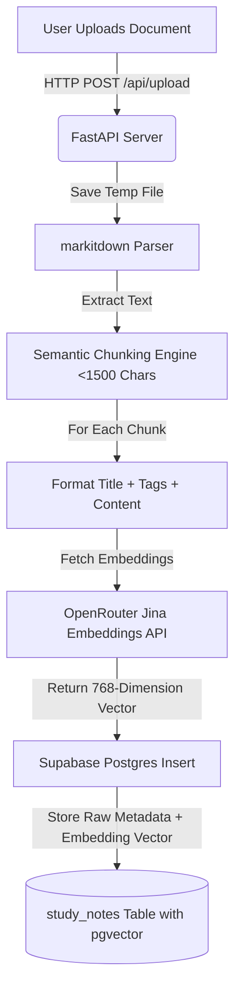
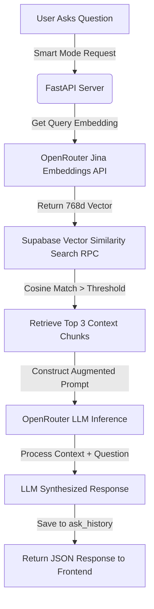
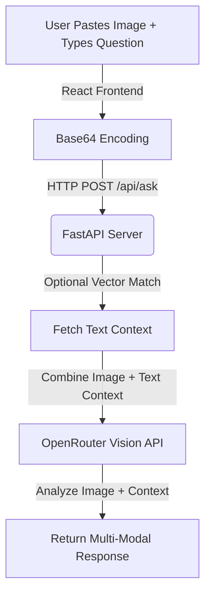

# 🧠 Smart AI Study Assistant

    

A full-stack, cloud-native **AI Study Assistant** that uses **Retrieval-Augmented Generation (RAG)** to answer questions based entirely on your uploaded documents, notes, and images.

Built as an AI mini-project, this application allows users to upload any document (PDF, Excel, Word), paste images directly into the chat, or use their voice to ask questions. The AI intelligently retrieves relevant context from a Supabase vector database and synthesizes accurate, hallucination-free answers.

## ✨ Key Features

- **📄 Universal Document Parsing**: Upload PDFs, Word documents, Excel sheets, and text files. The app extracts text natively without complex setups using `markitdown`.
- **🔍 Retrieval-Augmented Generation (RAG)**: Chat directly with your documents. The AI strictly answers based on the uploaded notes, preventing hallucinations.
- **👁️ Multimodal Vision Support**: Paste an image (diagrams, charts, math problems) directly into the chat. The application uses OpenRouter's Vision models to "see" the image and answer complex queries.
- **🎙️ Voice-to-Text & Text-to-Speech**: Hands-free studying! Dictate your questions using the microphone, and have the AI read the answers back to you.
- **☁️ 100% Serverless Cloud Architecture**: The backend runs entirely on stateless Vercel Python serverless functions, connected to a Supabase Postgres database.
- **🧠 Advanced Vector Search**: Uses `jina-embeddings-v2` and Supabase `pgvector` for hyper-accurate semantic similarity matching.
- **🎨 Glassmorphism UI**: A beautiful, modern, and highly responsive user interface built with React, TailwindCSS, and Framer Motion.

---

## 🧠 Core Technologies Explained

### 1. The NLP Pipeline: Data Ingestion (How the AI "Reads")
When a document (PDF, Word, etc.) is uploaded, the system triggers a powerful **Natural Language Processing (NLP)** pipeline:
- **Text Extraction**: The backend uses NLP libraries (`markitdown`, `pdfminer`) to parse binary files and extract raw, readable text.
- **Chunking**: Large documents are split into smaller paragraphs (~1500 characters) to optimize the LLM's context window.
- **Semantic Embedding**: Each text chunk is sent to an embedding model (`jina-embeddings-v2-base-en`). The NLP model converts the text's *semantic meaning* into a **768-dimensional mathematical vector**.
- **Vector Storage**: These vectors are saved securely into a Supabase database using the `pgvector` extension.

### 2. The RAG Pipeline: Query & Generation (How the AI "Thinks")
When you ask a question in "Smart AI" mode, the **Retrieval-Augmented Generation (RAG)** pipeline executes:
- **Retrieval**: The backend converts your question into a 768-dimensional vector and runs a **Cosine Similarity Search** in Supabase to find the top 3 paragraphs that are mathematically "closest" in meaning to your question.
- **Augmentation**: The backend creates a hidden prompt, injecting those 3 retrieved paragraphs as strict context.
- **Generation**: The Large Language Model (e.g., Gemini or GPT-4o) reads the augmented prompt and generates a conversational answer based *only* on the retrieved context, effectively eliminating hallucinations.


---

## 🔄 End-to-End System Workflows

This project implements three primary workflows: **Document Ingestion (NLP)**, **Semantic Q&A (RAG)**, and **Multimodal Visual Reasoning**.

### 1. Document Upload & NLP Indexing Pipeline
When a user uploads a document (PDF, DOCX, XLSX, TXT) via the dashboard:
1. **File Reception**: FastAPI accepts the binary file, creates a temporary file on disk, and passes it to Microsoft's `markitdown` parser.
2. **Text Extraction**: The parser extracts structural text, retaining tables, markdown layout, and text blocks.
3. **Semantic Chunking**: Large blocks of text are parsed and split into overlapping chunks of approximately 1,500 characters. This maintains contextual integrity while adhering to the LLM context size and search specificity limits.
4. **Embedding Generation**: For each chunk, the content is compiled (including title and tags) and sent to the Jina AI embeddings model (`jina-embeddings-v2-base-en`). This model maps the semantic meaning of the text onto a **768-dimensional floating-point vector space**.
5. **Database Storage**: The raw text, title, document ID, tags, and the high-dimensional embedding vector are saved into Supabase Postgres database.



### 2. Retrieval-Augmented Generation (RAG) Query Pipeline
When a query is executed in **Smart Mode**:
1. **Query Embedding**: The user's prompt is embedded into a 768-dimensional vector using Jina AI embeddings.
2. **Cosine Similarity Search**: FastAPI queries Supabase using a Remote Procedure Call (RPC) `match_study_notes`. This compares the question vector against all stored note vectors using cosine distance computation ($1 - \text{cosine\_distance}$).
3. **Context Construction**: The top $K$ (configured to 3) highest scoring text blocks are retrieved.
4. **Prompt Augmentation**: The retrieved text chunks are injected into a structured system prompt as "Ground Truth" context.
5. **Inference & Stream**: The model (configured via OpenRouter) processes the augmented prompt under strict instructions to answer *only* based on the context, preventing AI hallucinations.



### 3. Multimodal Vision Pipeline
When a user pastes an image (diagram, equation, flowchart) into the chat:
1. **Base64 Encoding**: The React frontend reads the clipboard, converts the image to base64 data, and previews it in the UI.
2. **Context Retrieval**: The query text's vector is matched against the database to fetch text context.
3. **Multimodal API Request**: The text context, question, and base64 image data are bundled as a multimodal payload and sent to OpenRouter's vision models.



---

## 🛠️ Step-by-Step Development Journey (How It Was Made)

The system evolved through distinct development phases, focusing on scalability, serverless compatibility, and modern UI design.

### Phase 1: Local Ideation & Monolithic Prototypes
- **Initial Setup**: The project started as a Python backend and simple HTML file testing keyword-based search.
- **Classic Search Engine**: Built an in-memory TF-IDF search implementation using Python's standard `re` and `collections.Counter` libraries. This allowed the system to perform fast keyword matching without needing external heavy NLP libraries like Scikit-learn or NLTK, making it lightweight.
- **Local Persistence**: Uploaded notes were stored in a local flat JSON file (`notes.json`), and embeddings were generated locally and index-searched via `ChromaDB` (a local directory-based vector store).

### Phase 2: The Serverless Cloud Migration
When shifting from a local proof-of-concept to a production cloud deployment, two major architectural barriers were encountered:
1. **Ephemerality of Serverless Functions**: Hosting the FastAPI app on Vercel Serverless Functions meant that the backend environment was entirely stateless. Server instances spin up to handle requests and shut down immediately after. This meant a local SQLite file database or ChromaDB filesystem directory would be wiped clean on cold starts, losing all uploaded files.
2. **Stateless Vector database solution**: We migrated the database completely to **Supabase**.
   - SQLite was replaced by hosted **PostgreSQL**.
   - ChromaDB was replaced by **`pgvector`** (a native Postgres vector search extension).
   - This database architecture allows our backend functions on Vercel to remain stateless, querying the vector database via cloud network connections.

#### 📁 Cloud Database Schema Definitions
To configure the Supabase cloud PostgreSQL server, the following SQL was executed to initialize pgvector and establish matching procedures:

```sql
-- 1. Enable the pgvector extension to store and search vector math
create extension if not exists vector;

-- 2. Create the study_notes table
create table study_notes (
    id text primary key,
    title text not null,
    content text not null,
    tags text[] default '{}',
    document_id text,
    document_title text,
    embedding vector(768) -- Store 768-dimension Jina embeddings
);

-- 3. Create ask_history table to track learning progress
create table ask_history (
    id text primary key,
    question text not null,
    answer text not null,
    asked_at timestamp with time zone default timezone('utc'::text, now()) not null,
    matched_note_id text
);

-- 4. Create a vector similarity RPC function for cosine similarity matching
create or replace function match_study_notes (
  query_embedding vector(768),
  match_threshold float,
  match_count int,
  filter_document_id text default null
)
returns table (
  id text,
  title text,
  content text,
  tags text[],
  document_id text,
  document_title text,
  similarity float
)
language plpgsql
as $$
begin
  return query
  select
    study_notes.id,
    study_notes.title,
    study_notes.content,
    study_notes.tags,
    study_notes.document_id,
    study_notes.document_title,
    1 - (study_notes.embedding <=> query_embedding) as similarity -- Cosine Similarity formula
  from study_notes
  where (filter_document_id is null or study_notes.document_id = filter_document_id)
    and study_notes.embedding is not null
    and 1 - (study_notes.embedding <=> query_embedding) > match_threshold
  order by study_notes.embedding <=> query_embedding
  limit match_count;
end;
$$;
```

### Phase 3: Building the Universal Parsing Engine
- A major challenge was parsing arbitrary document uploads (PDF, Excel, Word). We integrated Microsoft's `markitdown` library.
- This library handles decoding DOCX, XLSX, and PDF content into plain text recursively, eliminating the need for separate parser libraries (like PyPDF2, openpyxl, etc.) and keeping the codebase clean.

### Phase 4: OpenRouter & Multimodal UI Integration
- Instead of binding the application to a single LLM provider (like OpenAI or Anthropic), we integrated OpenRouter. This provides a unified API endpoint to swap models (such as `Google Gemini`, `Claude 3.5 Sonnet`, or `GPT-4o`) seamlessly without rewriting backend code.
- Integrated multimodal support allowing users to upload drawings/images, which are converted to Base64 and sent along with textual context to OpenRouter models for vision reasoning.

### Phase 5: Modern UI Development
- Built the frontend with **Vite + React.js** to enable instant hot-reloading and high runtime performance.
- Styled with TailwindCSS and implemented a gorgeous **Glassmorphism design language** (translucent backdrops, frosted-glass panels, custom dark-mode gradients).
- Added Framer Motion for smooth screen transitions and speech-bubble animations.
- Implemented **Web Speech API** natively for dictation and TTS (Text-to-Speech), offering hands-free learning capabilities directly inside the browser.

---


## 🏗️ Architecture & Tech Stack

### Frontend
- **React.js (Vite)**: Fast, modern frontend framework.
- **TailwindCSS**: For responsive, utility-first styling.
- **Framer Motion**: For fluid micro-animations and page transitions.
- **React Markdown**: To render beautifully formatted tables, code, and text from the LLM.
- **Web Speech API**: For native voice recognition and speech synthesis.

### Backend
- **FastAPI (Python)**: High-performance backend framework serving as a stateless serverless API on Vercel.
- **Supabase (PostgreSQL)**: Primary cloud database storing notes and chat history.
- **pgvector**: PostgreSQL extension used to store 768-dimensional embeddings and perform cosine similarity math.
- **OpenRouter API**: Accesses state-of-the-art LLMs (Gemini, Claude, GPT-4o) and Vision models through a single endpoint.
- **Jina AI**: Used via OpenRouter for blazing-fast text embeddings.

---

## 🚀 Live Demo

- **Frontend Application**: [https://frontend-alpha-six-41.vercel.app](https://frontend-alpha-six-41.vercel.app)
- **Backend API Endpoint**: [https://backend-seven-wine-16.vercel.app](https://backend-seven-wine-16.vercel.app)

---

## 🛠️ Local Setup & Installation

If you want to run this project locally on your machine, follow these steps:

### Prerequisites
- Node.js (v18+)
- Python (v3.10+)
- An [OpenRouter](https://openrouter.ai/) API Key
- A [Supabase](https://supabase.com/) Project with `pgvector` enabled

### 1. Clone the Repository
```bash
git clone https://github.com/adityasing9/Smart-AI-Study-Assistant.git
cd Smart-AI-Study-Assistant
```

### 2. Backend Setup
```bash
cd backend

# Create a virtual environment
python -m venv venv
source venv/bin/activate  # On Windows use: venv\Scripts\activate

# Install dependencies
pip install -r requirements.txt

# Setup Environment Variables
# Create a .env file in the backend folder:
# SUPABASE_URL="your-supabase-project-url"
# SUPABASE_ANON_KEY="your-supabase-anon-key"
# OPENROUTER_API_KEY="your-openrouter-key"

# Run the FastAPI server
python -m uvicorn main:app --reload --port 8000
```

### 3. Frontend Setup
```bash
cd ../frontend

# Install Node modules
npm install

# Setup Environment Variables
# Create a .env file in the frontend folder:
# VITE_API_URL="http://127.0.0.1:8000/api"

# Start the Vite development server
npm run dev
```

---

## 📖 How to Use

1. **Upload Documents**: Navigate to the Dashboard and click "Add Notes" -> "Upload Document". Select any PDF or file to seed the AI's memory.
2. **Ask Questions**: Go to the "Ask AI" page. Type a question related to the uploaded document.
3. **Smart Mode vs Classic Mode**: 
   - *Smart Mode*: Uses embeddings, vector search, and the LLM to synthesize a conversational answer.
   - *Classic Mode*: Performs a fast, direct keyword lookup and returns the raw matching text chunk.
4. **Paste Images**: Copy an image and press `Ctrl+V` in the chat input. The UI will preview the image, and you can ask the AI to explain it!

---

*Built with ❤️ for better, smarter studying.*
