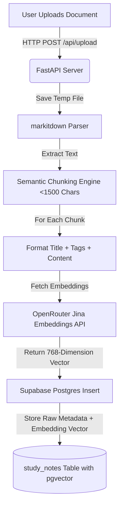
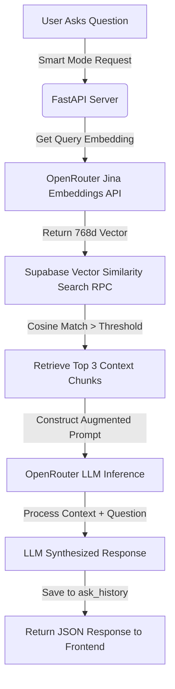
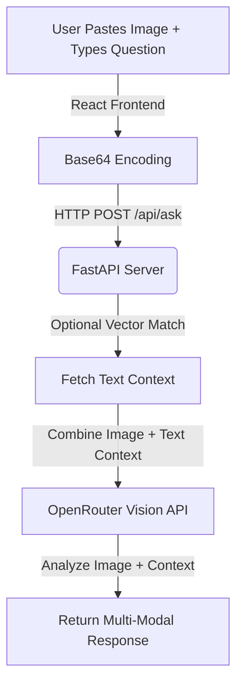

# 🧠 Smart AI Study Assistant

    

A full-stack, cloud-native **AI Study Assistant** that uses **Retrieval-Augmented Generation (RAG)** to answer questions based entirely on your uploaded documents, notes, and images.

Built as an AI mini-project, this application allows users to upload any document (PDF, Excel, Word), paste images directly into the chat, or use their voice to ask questions. The AI intelligently retrieves relevant context from a Supabase vector database and synthesizes accurate, hallucination-free answers.

## ✨ Key Features

- **📄 Universal Document Parsing**: Upload PDFs, Word documents, Excel sheets, and text files. The app extracts text natively without complex setups using `markitdown`.
- **🔍 Retrieval-Augmented Generation (RAG)**: Chat directly with your documents. The AI strictly answers based on the uploaded notes, preventing hallucinations.
- **👁️ Multimodal Vision Support**: Paste an image (diagrams, charts, math problems) directly into the chat. The application uses OpenRouter's Vision models to "see" the image and answer complex queries.
- **🎙️ Voice-to-Text & Text-to-Speech**: Hands-free studying! Dictate your questions using the microphone, and have the AI read the answers back to you.
- **☁️ 100% Serverless Cloud Architecture**: The backend runs entirely on stateless Vercel Python serverless functions, connected to a Supabase Postgres database.
- **🧠 Advanced Vector Search**: Uses `jina-embeddings-v2` and Supabase `pgvector` for hyper-accurate semantic similarity matching.
- **🎨 Glassmorphism UI**: A beautiful, modern, and highly responsive user interface built with React, TailwindCSS, and Framer Motion.

---

## 🧠 Core Technologies Explained

### 1. The NLP Pipeline: Data Ingestion (How the AI "Reads")
When a document (PDF, Word, etc.) is uploaded, the system triggers a powerful **Natural Language Processing (NLP)** pipeline:
- **Text Extraction**: The backend uses NLP libraries (`markitdown`, `pdfminer`) to parse binary files and extract raw, readable text.
- **Chunking**: Large documents are split into smaller paragraphs (~1500 characters) to optimize the LLM's context window.
- **Semantic Embedding**: Each text chunk is sent to an embedding model (`jina-embeddings-v2-base-en`). The NLP model converts the text's *semantic meaning* into a **768-dimensional mathematical vector**.
- **Vector Storage**: These vectors are saved securely into a Supabase database using the `pgvector` extension.

### 2. The RAG Pipeline: Query & Generation (How the AI "Thinks")
When you ask a question in "Smart AI" mode, the **Retrieval-Augmented Generation (RAG)** pipeline executes:
- **Retrieval**: The backend converts your question into a 768-dimensional vector and runs a **Cosine Similarity Search** in Supabase to find the top 3 paragraphs that are mathematically "closest" in meaning to your question.
- **Augmentation**: The backend creates a hidden prompt, injecting those 3 retrieved paragraphs as strict context.
- **Generation**: The Large Language Model (e.g., Gemini or GPT-4o) reads the augmented prompt and generates a conversational answer based *only* on the retrieved context, effectively eliminating hallucinations.


---

## 🔄 End-to-End System Workflows

This project implements three primary workflows: **Document Ingestion (NLP)**, **Semantic Q&A (RAG)**, and **Multimodal Visual Reasoning**.

### 1. Document Upload & NLP Indexing Pipeline
When a user uploads a document (PDF, DOCX, XLSX, TXT) via the dashboard:
1. **File Reception**: FastAPI accepts the binary file, creates a temporary file on disk, and passes it to Microsoft's `markitdown` parser.
2. **Text Extraction**: The parser extracts structural text, retaining tables, markdown layout, and text blocks.
3. **Semantic Chunking**: Large blocks of text are parsed and split into overlapping chunks of approximately 1,500 characters. This maintains contextual integrity while adhering to the LLM context size and search specificity limits.
4. **Embedding Generation**: For each chunk, the content is compiled (including title and tags) and sent to the Jina AI embeddings model (`jina-embeddings-v2-base-en`). This model maps the semantic meaning of the text onto a **768-dimensional floating-point vector space**.
5. **Database Storage**: The raw text, title, document ID, tags, and the high-dimensional embedding vector are saved into Supabase Postgres database.



### 2. Retrieval-Augmented Generation (RAG) Query Pipeline
When a query is executed in **Smart Mode**:
1. **Query Embedding**: The user's prompt is embedded into a 768-dimensional vector using Jina AI embeddings.
2. **Cosine Similarity Search**: FastAPI queries Supabase using a Remote Procedure Call (RPC) `match_study_notes`. This compares the question vector against all stored note vectors using cosine distance computation ($1 - \text{cosine\_distance}$).
3. **Context Construction**: The top $K$ (configured to 3) highest scoring text blocks are retrieved.
4. **Prompt Augmentation**: The retrieved text chunks are injected into a structured system prompt as "Ground Truth" context.
5. **Inference & Stream**: The model (configured via OpenRouter) processes the augmented prompt under strict instructions to answer *only* based on the context, preventing AI hallucinations.



### 3. Multimodal Vision Pipeline
When a user pastes an image (diagram, equation, flowchart) into the chat:
1. **Base64 Encoding**: The React frontend reads the clipboard, converts the image to base64 data, and previews it in the UI.
2. **Context Retrieval**: The query text's vector is matched against the database to fetch text context.
3. **Multimodal API Request**: The text context, question, and base64 image data are bundled as a multimodal payload and sent to OpenRouter's vision models.



---

## 🛠️ Step-by-Step Development Journey (How It Was Made)

The system evolved through distinct development phases, focusing on scalability, serverless compatibility, and modern UI design.

### Phase 1: Local Ideation & Monolithic Prototypes
- **Initial Setup**: The project started as a Python backend and simple HTML file testing keyword-based search.
- **Classic Search Engine**: Built an in-memory TF-IDF search implementation using Python's standard `re` and `collections.Counter` libraries. This allowed the system to perform fast keyword matching without needing external heavy NLP libraries like Scikit-learn or NLTK, making it lightweight.
- **Local Persistence**: Uploaded notes were stored in a local flat JSON file (`notes.json`), and embeddings were generated locally and index-searched via `ChromaDB` (a local directory-based vector store).

### Phase 2: The Serverless Cloud Migration
When shifting from a local proof-of-concept to a production cloud deployment, two major architectural barriers were encountered:
1. **Ephemerality of Serverless Functions**: Hosting the FastAPI app on Vercel Serverless Functions meant that the backend environment was entirely stateless. Server instances spin up to handle requests and shut down immediately after. This meant a local SQLite file database or ChromaDB filesystem directory would be wiped clean on cold starts, losing all uploaded files.
2. **Stateless Vector database solution**: We migrated the database completely to **Supabase**.
   - SQLite was replaced by hosted **PostgreSQL**.
   - ChromaDB was replaced by **`pgvector`** (a native Postgres vector search extension).
   - This database architecture allows our backend functions on Vercel to remain stateless, querying the vector database via cloud network connections.

#### 📁 Cloud Database Schema Definitions
To configure the Supabase cloud PostgreSQL server, the following SQL was executed to initialize pgvector and establish matching procedures:

```sql
-- 1. Enable the pgvector extension to store and search vector math
create extension if not exists vector;

-- 2. Create the study_notes table
create table study_notes (
    id text primary key,
    title text not null,
    content text not null,
    tags text[] default '{}',
    document_id text,
    document_title text,
    embedding vector(768) -- Store 768-dimension Jina embeddings
);

-- 3. Create ask_history table to track learning progress
create table ask_history (
    id text primary key,
    question text not null,
    answer text not null,
    asked_at timestamp with time zone default timezone('utc'::text, now()) not null,
    matched_note_id text
);

-- 4. Create a vector similarity RPC function for cosine similarity matching
create or replace function match_study_notes (
  query_embedding vector(768),
  match_threshold float,
  match_count int,
  filter_document_id text default null
)
returns table (
  id text,
  title text,
  content text,
  tags text[],
  document_id text,
  document_title text,
  similarity float
)
language plpgsql
as $$
begin
  return query
  select
    study_notes.id,
    study_notes.title,
    study_notes.content,
    study_notes.tags,
    study_notes.document_id,
    study_notes.document_title,
    1 - (study_notes.embedding <=> query_embedding) as similarity -- Cosine Similarity formula
  from study_notes
  where (filter_document_id is null or study_notes.document_id = filter_document_id)
    and study_notes.embedding is not null
    and 1 - (study_notes.embedding <=> query_embedding) > match_threshold
  order by study_notes.embedding <=> query_embedding
  limit match_count;
end;
$$;
```

### Phase 3: Building the Universal Parsing Engine
- A major challenge was parsing arbitrary document uploads (PDF, Excel, Word). We integrated Microsoft's `markitdown` library.
- This library handles decoding DOCX, XLSX, and PDF content into plain text recursively, eliminating the need for separate parser libraries (like PyPDF2, openpyxl, etc.) and keeping the codebase clean.

### Phase 4: OpenRouter & Multimodal UI Integration
- Instead of binding the application to a single LLM provider (like OpenAI or Anthropic), we integrated OpenRouter. This provides a unified API endpoint to swap models (such as `Google Gemini`, `Claude 3.5 Sonnet`, or `GPT-4o`) seamlessly without rewriting backend code.
- Integrated multimodal support allowing users to upload drawings/images, which are converted to Base64 and sent along with textual context to OpenRouter models for vision reasoning.

### Phase 5: Modern UI Development
- Built the frontend with **Vite + React.js** to enable instant hot-reloading and high runtime performance.
- Styled with TailwindCSS and implemented a gorgeous **Glassmorphism design language** (translucent backdrops, frosted-glass panels, custom dark-mode gradients).
- Added Framer Motion for smooth screen transitions and speech-bubble animations.
- Implemented **Web Speech API** natively for dictation and TTS (Text-to-Speech), offering hands-free learning capabilities directly inside the browser.

---


## 🏗️ Architecture & Tech Stack

### Frontend
- **React.js (Vite)**: Fast, modern frontend framework.
- **TailwindCSS**: For responsive, utility-first styling.
- **Framer Motion**: For fluid micro-animations and page transitions.
- **React Markdown**: To render beautifully formatted tables, code, and text from the LLM.
- **Web Speech API**: For native voice recognition and speech synthesis.

### Backend
- **FastAPI (Python)**: High-performance backend framework serving as a stateless serverless API on Vercel.
- **Supabase (PostgreSQL)**: Primary cloud database storing notes and chat history.
- **pgvector**: PostgreSQL extension used to store 768-dimensional embeddings and perform cosine similarity math.
- **OpenRouter API**: Accesses state-of-the-art LLMs (Gemini, Claude, GPT-4o) and Vision models through a single endpoint.
- **Jina AI**: Used via OpenRouter for blazing-fast text embeddings.

---

## 🚀 Live Demo

- **Frontend Application**: [https://frontend-alpha-six-41.vercel.app](https://frontend-alpha-six-41.vercel.app)
- **Backend API Endpoint**: [https://backend-seven-wine-16.vercel.app](https://backend-seven-wine-16.vercel.app)

---

## 🛠️ Local Setup & Installation

If you want to run this project locally on your machine, follow these steps:

### Prerequisites
- Node.js (v18+)
- Python (v3.10+)
- An [OpenRouter](https://openrouter.ai/) API Key
- A [Supabase](https://supabase.com/) Project with `pgvector` enabled

### 1. Clone the Repository
```bash
git clone https://github.com/adityasing9/Smart-AI-Study-Assistant.git
cd Smart-AI-Study-Assistant
```

### 2. Backend Setup
```bash
cd backend

# Create a virtual environment
python -m venv venv
source venv/bin/activate  # On Windows use: venv\Scripts\activate

# Install dependencies
pip install -r requirements.txt

# Setup Environment Variables
# Create a .env file in the backend folder:
# SUPABASE_URL="your-supabase-project-url"
# SUPABASE_ANON_KEY="your-supabase-anon-key"
# OPENROUTER_API_KEY="your-openrouter-key"

# Run the FastAPI server
python -m uvicorn main:app --reload --port 8000
```

### 3. Frontend Setup
```bash
cd ../frontend

# Install Node modules
npm install

# Setup Environment Variables
# Create a .env file in the frontend folder:
# VITE_API_URL="http://127.0.0.1:8000/api"

# Start the Vite development server
npm run dev
```

---

## 📖 How to Use

1. **Upload Documents**: Navigate to the Dashboard and click "Add Notes" -> "Upload Document". Select any PDF or file to seed the AI's memory.
2. **Ask Questions**: Go to the "Ask AI" page. Type a question related to the uploaded document.
3. **Smart Mode vs Classic Mode**: 
   - *Smart Mode*: Uses embeddings, vector search, and the LLM to synthesize a conversational answer.
   - *Classic Mode*: Performs a fast, direct keyword lookup and returns the raw matching text chunk.
4. **Paste Images**: Copy an image and press `Ctrl+V` in the chat input. The UI will preview the image, and you can ask the AI to explain it!

---

## 🎓 50 Viva Questions & Answers

> Click on any question to reveal its answer.

| # | Category | Questions |
|---|----------|-----------|
| 1 | Project Overview & Core Concept | Q1 – Q8 |
| 2 | NLP, Parsing & Document Ingestion | Q9 – Q15 |
| 3 | Vector Embeddings & Similarity Math | Q16 – Q23 |
| 4 | Supabase, PostgreSQL & Vector Databases | Q24 – Q31 |
| 5 | RAG & LLMs | Q32 – Q38 |
| 6 | Backend, Serverless & Deployment | Q39 – Q44 |
| 7 | Frontend, UI/UX & Interactive Features | Q45 – Q50 |

---

### 📂 Category 1: Project Overview & Core Concept

<details>
<summary><strong>Q1. What is the main objective of this project?</strong></summary>

The objective is to build a full-stack, cloud-native **Smart AI Study Assistant** that allows students to upload textbooks, notes, and diagrams, and then ask questions. The application uses **Retrieval-Augmented Generation (RAG)** to provide accurate, context-aware answers based *only* on the uploaded documents, eliminating AI hallucinations.
</details>

<details>
<summary><strong>Q2. What is the difference between "Smart Mode" and "Classic Mode" in your app?</strong></summary>

- **Smart Mode** uses advanced AI. It converts the user's question into a mathematical vector, retrieves relevant document chunks from a vector database (using Cosine Similarity), injects them into an LLM (via OpenRouter), and generates a conversational answer.
- **Classic Mode** is a lightweight search engine. It extracts keywords from the question, scores notes using term-frequency and field weighting (Title > Tags > Content) without calling an LLM, and highlights the best matching raw document snippet.
</details>

<details>
<summary><strong>Q3. What is the high-level architecture of this application?</strong></summary>

The application follows a modern decoupled frontend/backend architecture:
- **Frontend**: React.js (Vite) styled with TailwindCSS and animated with Framer Motion.
- **Backend**: FastAPI (Python) running as stateless serverless functions on Vercel.
- **Database**: Supabase PostgreSQL with the `pgvector` extension.
- **AI Integrations**: OpenRouter for LLM text generation/vision APIs and Jina AI for vector embeddings.
</details>

<details>
<summary><strong>Q4. Why did you choose FastAPI for the backend instead of Flask or Django?</strong></summary>

1. It is extremely fast and high-performance, built on ASGI standards (`uvicorn`).
2. It has native support for asynchronous programming (`async/await`), which is crucial for handling slow external API calls (OpenRouter, Supabase).
3. It provides automatic interactive API documentation (Swagger UI).
4. It is lightweight, which keeps cold starts short when deployed as serverless functions on Vercel.
</details>

<details>
<summary><strong>Q5. Why did you choose React (Vite) for the frontend?</strong></summary>

React allows us to build a dynamic, stateful Single Page Application (SPA). Using **Vite** instead of Create React App (CRA) provides lightning-fast build times, instant Hot Module Replacement (HMR) during development, and highly optimized production bundles.
</details>

<details>
<summary><strong>Q6. Can this project run completely offline?</strong></summary>

The current architecture relies on cloud APIs (OpenRouter for LLM/Embeddings and Supabase for cloud database), so it requires an active internet connection. To make it run offline, you would need to host local models (e.g., via Ollama/Llama.cpp) and run a local vector database (like ChromaDB or local Postgres) on the user's machine.
</details>

<details>
<summary><strong>Q7. What are the main challenges when building a study assistant for students?</strong></summary>

1. **Hallucinations**: LLMs making up facts not present in the study materials. (Solved via RAG).
2. **Parsing complex files**: Handling multi-column PDFs, tables, or scanned diagrams. (Solved using `markitdown` and vision models).
3. **Stateless deployment**: Keeping database entries persistent in serverless environments. (Solved using Supabase cloud DB).
</details>

<details>
<summary><strong>Q8. What security measures did you implement for this application?</strong></summary>

1. All API keys and database credentials are kept on the backend inside a secure `.env` file, never exposed to the client.
2. CORS policies are configured to control which domains can request resources from the FastAPI backend.
3. Database requests are made through secure, authenticated Supabase clients.
</details>

---

### 📄 Category 2: NLP, Parsing, & Document Ingestion

<details>
<summary><strong>Q9. How does the system extract text from uploaded files (PDFs, Word, Excel)?</strong></summary>

The backend uses Microsoft's **`markitdown`** library. When a file is uploaded, it is written to a temporary location, parsed by `markitdown` (which extracts plain text and formats tables/structures into clean markdown), and then deleted.
</details>

<details>
<summary><strong>Q10. What is "Chunking" and why is it necessary in a RAG pipeline?</strong></summary>

Chunking is the process of splitting a long document into smaller, readable text blocks. It is necessary because:
1. LLMs have strict input context limits (token window).
2. Embedding a whole 100-page book into a single vector dilutes the semantic details. Smaller chunks (e.g., 1,500 characters) ensure vector search targets highly specific sections.
</details>

<details>
<summary><strong>Q11. How is chunking implemented in your backend code?</strong></summary>

In `main.py`, we split the extracted text into paragraphs using double newlines (`\n\n`). We then iterate through them, grouping paragraphs together until a chunk reaches approximately 1,500 characters. If a document has no paragraph breaks, we segment the text directly by size.
</details>

<details>
<summary><strong>Q12. What is the purpose of overlapping chunks, and did you implement it?</strong></summary>

Chunk overlapping (e.g., keeping a 100–200 character overlap between consecutive chunks) prevents splitting a critical sentence or concept right down the middle, ensuring context is preserved across boundaries. In our current implementation, chunks are created by appending whole paragraphs together (not splitting mid-sentence), which naturally preserves context at paragraph boundaries.
</details>

<details>
<summary><strong>Q13. How does Classic Mode parse text search queries?</strong></summary>

Classic Mode uses **keyword extraction**. It takes the query, converts it to lowercase, removes punctuation, tokenizes it into words, and filters out common "stop words" (e.g., *the, is, and, explain, please*) to isolate the primary content keywords.
</details>

<details>
<summary><strong>Q14. What are "Stop Words"?</strong></summary>

Stop words are common words in a language (like *a, an, the, on, are, what*) that carry very little semantic weight. Removing them allows keyword-based matching systems to focus entirely on the main search terms (e.g., "explain photosynthesis" becomes just `['photosynthesis']`).
</details>

<details>
<summary><strong>Q15. How does the system handle images uploaded to the chat interface?</strong></summary>

The React frontend reads the clipboard image when the user pastes it (`Ctrl+V`), encodes it into a **Base64 Data URL**, and sends it in the JSON request payload. The backend detects the image data, packages it in a multimodal format (with `image_url` type), and sends it directly to OpenRouter's vision API alongside the text context.
</details>

---

### 🧮 Category 3: Vector Embeddings & Similarity Math

<details>
<summary><strong>Q16. What is a Vector Embedding?</strong></summary>

A vector embedding is a numerical representation of the semantic meaning of text. It converts words, sentences, or paragraphs into an array of floating-point numbers. Words or sentences with similar meanings are mathematically mapped closer together in this high-dimensional vector space.
</details>

<details>
<summary><strong>Q17. Which embedding model did you use, and what is its dimension size?</strong></summary>

We used **`jina-embeddings-v2-base-en`** via the OpenRouter API. It generates embeddings with **768 dimensions** (meaning each text chunk is represented by an array of 768 floating-point numbers).
</details>

<details>
<summary><strong>Q18. What is Cosine Similarity? Explain the math behind it.</strong></summary>

Cosine similarity measures the cosine of the angle between two vectors in a high-dimensional space. The formula is:

**Similarity = cos(θ) = (A · B) / (||A|| × ||B||)**

- A similarity of **1.0** means the vectors point in the exact same direction (semantically identical).
- A similarity of **0.0** means they are orthogonal (unrelated).
- In pgvector, we compute this using `1 - (embedding <=> query_embedding)`, where `<=>` is the cosine distance operator.
</details>

<details>
<summary><strong>Q19. Why is Cosine Similarity preferred over Euclidean Distance for text search?</strong></summary>

Cosine similarity measures the *angle* between vectors, focusing entirely on semantic direction. Euclidean distance measures the straight-line distance, which is highly sensitive to text length (magnitude). A short paragraph and a long paragraph discussing the same topic might have a large Euclidean distance but will have a very high Cosine Similarity.
</details>

<details>
<summary><strong>Q20. What is a 768-dimensional space conceptually?</strong></summary>

It means the model analyzes 768 distinct semantic properties (or features) of the text — such as tense, subject type, sentiment, and academic domain. The position of the text on each of these 768 axes determines its unique vector coordinates. While we cannot visualize 768 dimensions, the mathematical operations (like distance and angle) work identically to 2D or 3D geometry.
</details>

<details>
<summary><strong>Q21. What happens if the embedding API fails or responds slowly?</strong></summary>

We implement timeout handling (15.0 seconds in `httpx`) and standard `try-except` blocks. If the embedding generation fails, the system logs the error and returns an empty list, causing the search to gracefully return a "no relevant notes found" message rather than crashing.
</details>

<details>
<summary><strong>Q22. Why do we generate embeddings for the user's question during query time?</strong></summary>

In a vector-search system, we cannot search raw text against stored vectors. We must translate the user's question into the same 768-dimensional mathematical coordinate space as our document chunks so that we can compute cosine similarity and find the most relevant matches.
</details>

<details>
<summary><strong>Q23. How does Jina Embeddings v2 handle long-context inputs compared to standard models?</strong></summary>

Jina Embeddings v2 supports an extended context window (up to 8,192 tokens), making it well-suited for academic text. This allows embedding full paragraphs without truncation, preserving their semantic depth.
</details>

---

### 🗄️ Category 4: Supabase, PostgreSQL & Vector Databases

<details>
<summary><strong>Q24. What is pgvector, and why is it useful?</strong></summary>

`pgvector` is an open-source vector similarity search extension for **PostgreSQL**. It allows Postgres to store vectors (embeddings) directly in table columns, and perform fast similarity calculations (Cosine, L2, Inner Product) using native SQL queries. This eliminates the need for a separate vector database service.
</details>

<details>
<summary><strong>Q25. Why did you migrate from ChromaDB (local) to Supabase pgvector (cloud)?</strong></summary>

ChromaDB is a local, stateful file-based vector database. In a **serverless cloud backend** (like Vercel), server instances are stateless and ephemeral — any local database files are wiped on every cold start. Migrating to Supabase (a hosted PostgreSQL database in the cloud) ensures all documents, embeddings, and chat history are permanently persisted and accessible from anywhere.
</details>

<details>
<summary><strong>Q26. Explain the database schema you created in Supabase.</strong></summary>

We created two main tables and one stored procedure:
1. **`study_notes`**: Stores the text chunks. Columns: `id` (text, primary key), `title` (text), `content` (text), `tags` (text[]), `document_id` (text), `document_title` (text), and `embedding` (vector(768)).
2. **`ask_history`**: Stores chat history. Columns: `id` (text, primary key), `question` (text), `answer` (text), `asked_at` (timestamptz), and `matched_note_id` (text).
3. **`match_study_notes`** (stored procedure/RPC): Executes the cosine similarity search server-side and returns matching rows.
</details>

<details>
<summary><strong>Q27. What is an RPC in Supabase, and how did you use it?</strong></summary>

RPC stands for **Remote Procedure Call**. It is a way to execute a custom SQL function stored inside the Postgres database from our Python code. We call `match_study_notes` via `supabase.rpc("match_study_notes", params)`, passing the query embedding, match threshold, and match count. The complex vector similarity math runs entirely inside the database server.
</details>

<details>
<summary><strong>Q28. How does the filtering by document_id work in your vector search?</strong></summary>

In the SQL definition of `match_study_notes`, we have a parameter `filter_document_id`. The SQL query includes:
```sql
where (filter_document_id is null or study_notes.document_id = filter_document_id)
```
If the user scopes their chat to a specific uploaded document, only vector entries belonging to that document are compared — optimizing speed and accuracy.
</details>

<details>
<summary><strong>Q29. What is the significance of the match_threshold parameter?</strong></summary>

The `match_threshold` (set to 0.3) filters out irrelevant chunks. If the similarity score between a document chunk and the query vector is lower than 0.3, it is excluded from the results. This prevents the LLM from receiving completely unrelated context when a student asks off-topic questions.
</details>

<details>
<summary><strong>Q30. How does your application connect to Supabase from Python?</strong></summary>

We use the official `supabase` Python SDK. It reads the `SUPABASE_URL` and `SUPABASE_ANON_KEY` from backend environment variables and initializes a connection client to run queries, inserts, and RPC calls.
</details>

<details>
<summary><strong>Q31. What is a vector index (e.g., HNSW or IVFFlat)?</strong></summary>

Vector indexes speed up similarity search on large datasets:
- **IVFFlat (Inverted File Flat)**: Segments vectors into clusters and searches only the most relevant clusters. Faster but requires periodic rebuilding.
- **HNSW (Hierarchical Navigable Small World)**: Creates a multi-layered graph for approximate nearest-neighbour search. Higher recall and faster queries, but uses more memory.
</details>

---

### 🤖 Category 5: Retrieval-Augmented Generation (RAG) & LLMs

<details>
<summary><strong>Q32. What is Retrieval-Augmented Generation (RAG)?</strong></summary>

RAG is an architectural pattern that improves the outputs of Large Language Models. Instead of relying solely on the LLM's pre-trained knowledge, a RAG system first **retrieves** relevant documents from an external source (a vector database), **augments** the user's prompt by adding these documents as context, and then lets the LLM **generate** an answer based on this grounded context.
</details>

<details>
<summary><strong>Q33. How does RAG prevent LLM hallucinations?</strong></summary>

Hallucinations occur because LLMs are trained to predict the next word, sometimes generating plausible-sounding but false facts. RAG prevents this by supplying the actual reference text directly inside the prompt and instructing the model: *"Answer this question using only the provided context. Do not use outside knowledge if it contradicts the context."*
</details>

<details>
<summary><strong>Q34. What is OpenRouter, and why did you use it instead of calling OpenAI directly?</strong></summary>

OpenRouter is a unified API gateway that aggregates dozens of state-of-the-art LLMs (from OpenAI, Anthropic, Google, Meta, etc.) under a single standard API format. Benefits:
1. Swap underlying LLMs (Gemini → GPT-4o → Claude) with a simple environment variable change — zero code changes.
2. Competitive, pay-as-you-go pricing.
3. Unified format for both text generation and embedding APIs.
</details>

<details>
<summary><strong>Q35. How is the RAG prompt structured in your code?</strong></summary>

In `rag_engine.py`, the prompt has two parts:
- **System Prompt**: *"You are a smart study assistant. Use the provided context to answer the user's question clearly. Do not use outside knowledge if it contradicts the context."*
- **User Prompt**: Includes the retrieved context chunks separated by `---` dividers, followed by the user's question.
</details>

<details>
<summary><strong>Q36. What temperature setting did you use for the LLM, and why?</strong></summary>

We set the temperature to **0.3** (a low value). Lower temperatures make LLM output deterministic, focused, and factual — ideal for a study assistant where accuracy matters. Higher temperatures (like 0.8+) make responses creative and unpredictable, which is undesirable for academic Q&A.
</details>

<details>
<summary><strong>Q37. How does the application handle questions that are NOT found in the uploaded documents?</strong></summary>

Two safeguards:
1. **Vector search threshold**: If no chunks score above the 0.3 similarity threshold, the system returns "No relevant notes found" without calling the LLM at all.
2. **System prompt instruction**: If chunks are returned but don't contain the exact answer, the LLM is instructed to state that the information is not present in the provided study materials.
</details>

<details>
<summary><strong>Q38. Why do we retrieve only the top 3 chunks instead of all matching chunks?</strong></summary>

Retrieving only 3 chunks balances accuracy and cost:
1. **Token limits**: LLMs have maximum context windows; sending too many chunks exceeds this limit.
2. **Cost**: More tokens = higher API cost per request.
3. **Noise reduction**: Adding marginally relevant chunks can actually confuse the LLM and degrade answer quality.
</details>

---

### ⚡ Category 6: Backend, Serverless & Deployment

<details>
<summary><strong>Q39. What is a "Serverless Function" and how does Vercel run your Python backend?</strong></summary>

A serverless function is a stateless code execution block triggered by an HTTP request. Vercel automatically converts our FastAPI endpoints into serverless containers. When an API call arrives, Vercel routes it to our FastAPI app, computes the response, and tears down the container. There is no permanently running server.
</details>

<details>
<summary><strong>Q40. What configuration file tells Vercel how to deploy your FastAPI backend?</strong></summary>

The `vercel.json` file in the backend directory. It specifies that all requests should be routed to `main.py` using the `@vercel/python` builder, enabling Vercel to treat our FastAPI app as a serverless Python function.
</details>

<details>
<summary><strong>Q41. How did you implement CORS in your FastAPI app?</strong></summary>

We imported `CORSMiddleware` from FastAPI and configured it with:
```python
allow_origins=["*"]
allow_methods=["*"]
allow_headers=["*"]
```
This allows the React frontend (hosted on a different Vercel domain) to safely make cross-origin API requests without browser CORS blocking.
</details>

<details>
<summary><strong>Q42. What is the purpose of requirements.txt?</strong></summary>

It lists all the Python dependencies (like `fastapi`, `supabase`, `markitdown`, `openai`, `httpx`) required to run the backend. When deploying to Vercel, the platform reads this file and installs all packages automatically in the build environment before serving requests.
</details>

<details>
<summary><strong>Q43. How is temporary file storage handled in a serverless environment?</strong></summary>

Serverless environments lack persistent local filesystems. To parse uploaded documents, we use Python's built-in `tempfile` module to create a temporary file, run `markitdown` on it immediately, extract the text, and then delete the file with `os.remove()` — all within the same request lifecycle.
</details>

<details>
<summary><strong>Q44. What is the FastAPI lifespan event used for in your app?</strong></summary>

The `lifespan` context manager in FastAPI handles startup/shutdown logic. In our app, it was originally used to synchronize local notes into the vector store on server start. After cloud migration, this sync is disabled for Supabase to prevent mass re-embedding on every cold start, but the structure remains for future initialization tasks.
</details>

---

### 🎨 Category 7: Frontend, UI/UX & Interactive Features

<details>
<summary><strong>Q45. What is "Glassmorphism" in UI design?</strong></summary>

Glassmorphism is a modern design trend characterized by translucent, frosted-glass-like elements. It is achieved using CSS `backdrop-filter: blur()`, thin semi-transparent white borders, and soft shadows, overlaid on vibrant gradient backgrounds to give a premium, layered, depth-rich aesthetic.
</details>

<details>
<summary><strong>Q46. How does the speech recognition feature work in the frontend?</strong></summary>

It uses the browser's native **Web Speech API** (`window.SpeechRecognition` or `window.webkitSpeechRecognition`). When the user clicks the microphone button, the browser accesses the device microphone, listens to the user's voice, converts the audio into text using the browser's built-in speech engine, and populates the chat input field.
</details>

<details>
<summary><strong>Q47. How does the Text-to-Speech (TTS) feature read answers back to the student?</strong></summary>

It uses the **SpeechSynthesis** interface of the Web Speech API (`window.speechSynthesis`). We create a `SpeechSynthesisUtterance` instance with the LLM's text response, select an available system voice, and call the browser's synthesis engine to speak the text aloud — enabling hands-free studying.
</details>

<details>
<summary><strong>Q48. How does the frontend display Markdown tables, code blocks, and lists from the LLM?</strong></summary>

We use the **`react-markdown`** package. It parses raw markdown strings returned by the LLM and dynamically renders them as properly formatted HTML elements (like `<table>`, `<ul>`, `<code>`, `<pre>`) styled with Tailwind classes — rather than showing raw plain text with asterisks and pipes.
</details>

<details>
<summary><strong>Q49. What is Framer Motion, and where is it used?</strong></summary>

Framer Motion is a popular React animation library. We use it for:
- **Chat bubble animations** — messages fade and slide in smoothly.
- **Page transitions** — routes crossfade between dashboard and chat pages.
- **Card hover effects** — dashboard cards scale and glow on hover.
This makes the application feel responsive and premium.
</details>

<details>
<summary><strong>Q50. How does the React frontend communicate with the FastAPI backend across different domains?</strong></summary>

In `api.js`, we define an `API_BASE` URL that reads the `VITE_API_URL` environment variable. If not set, it falls back to the live production Vercel backend URL (`https://backend-seven-wine-16.vercel.app/api`). All API fetch requests use this base URL with standard `fetch()` calls, sending/receiving JSON payloads.
</details>

---

*Built with ❤️ for better, smarter studying. Good luck with your viva! 🎓*

